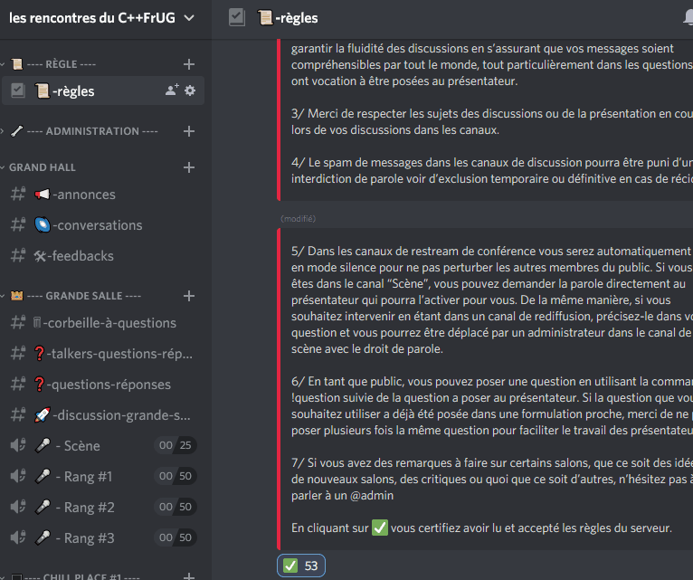
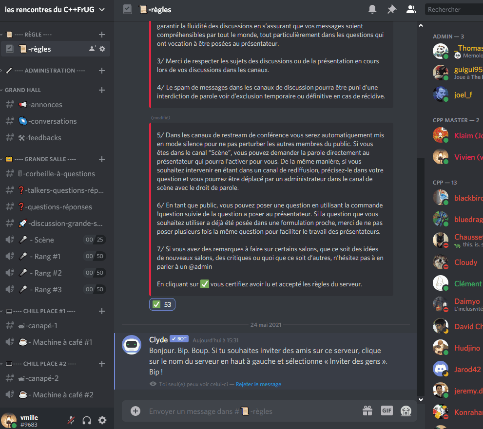
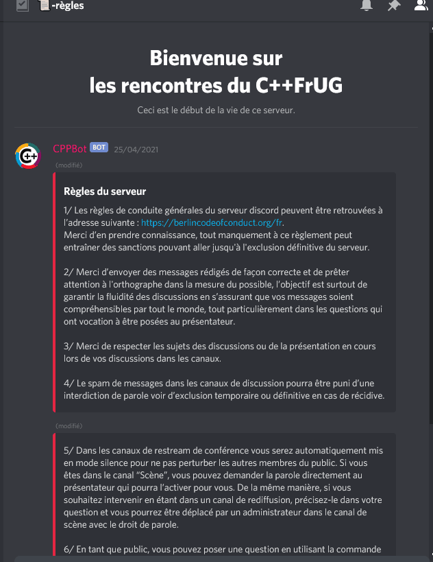
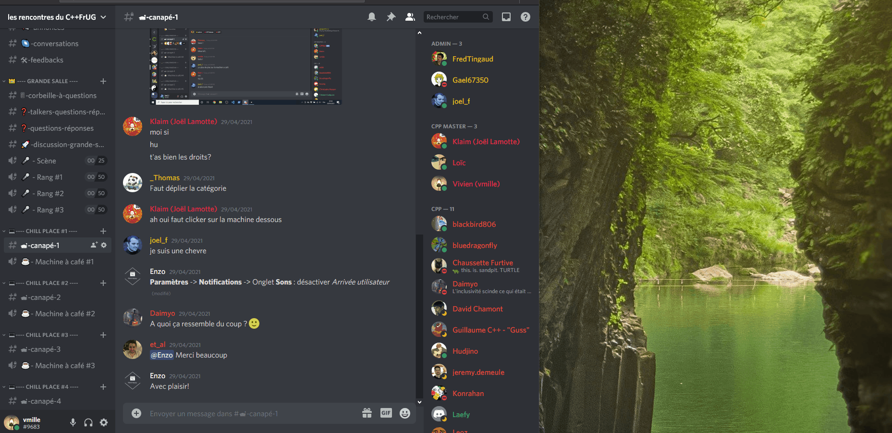

# Tuto Discord

# Pseudo
Discord permet de choisir un pseudo différent par serveur. Pour cela :

- Cliquez sur la flèche à côté du nom du serveur en haut à gauche
- "Changer de pseudo"

Nous vous conseillons de mettre le nom par lequel vous souhaitez être appelé, afin de faciliter les échanges, ainsi que votre pseudo usuel dans la communauté entre parenthèses.

# Notifications

Discord émet un son de notification lors de l'arrivée ou du départ d'un participant dans un salon. Pour supprimer ces notifications :
- en bas à droite, "Paramètres utilisateur"
- "Notifications"/"Sons"
- Décocher "Arrivée utilisateur" et "Départ utilisateur"

# Code of Conduct
La première fois que vous vous connectez au serveur, une lecture du Code of Conduct vous est demandée. Nous suivons le Berlin CoC. Après lecture, pour accéder au serveur, valider le CoC en cliquant sur la coche verte au pied du message.

# Canaux
Il y a 2 type de canaux de discussion dans Discord:
Les canaux audio/video: où les membres peuvent échanger en parlant et en utilisant leurs webcams. Il est possible de partager son écran aux autres participants du canal. Vous ne pouvez entrer que dans 1 seul canal de ce type à la fois.
Les canaux textuels: où l’on discute par texte (messagerie instantanée/chat)
**_Tous les canaux textes peuvent être consultés même lorsque que vous êtes dans un canal vidéo, ce qui permet de partager des liens, des fragments de code, ...**_

Les présentations vidéos (introduction, talks, lightning talks) doivent être consultées depuis des canaux spécifiques : les “rangs”. Dans ces canaux, vous ne pouvez que suivre la présentation : il n’est pas possible d’allumer sa caméra, son micro ou de partager son écran. Il existe plusieurs “rangs” afin de pallier les limitations de Discord. Chaque “rang” aura une retransmission en simultanée de la présentation.

Si vous rencontrez des problèmes de connexion qui n'aboutissent pas dans certains canaux, vous pouvez changer certains paramètres : “Paramètres utilisateurs” -> “Voix & Vidéos” -> Décocher “Activer la qualité du service Priorisation des paquets”.

## Description des différents canaux :
- Règle
    - _règles_ : Page d'accueil du serveur contenant le Code of Conduct ainsi que le présent message
- Chill place #1,2,3,4
    - _Machine à café 1,2,3,4_ : salon vidéo et vocal pour échanger plus facilement avec les autres participants
    - _canapé 1,2,3,4_ : salon textuel pour partager avec les participants à la Machine à café
- Grand hall
    - _annonces_ : Diffusion des annonces par les organisateurs (début de conf, changement de planning, ...). Seuls les admins peuvent poster des messages.
    - _conversations_ : Discussion public avec toutes les personnes présentes sur le serveur
    - _feedback_ : Permet d'exprimer ce qui vous a plu, ce qui ne vous a pas convenu, ce qui est améliorable, ...
- Grande salle
    - _questions-réponses_ : Poser des questions sur la présentation en cours. Pour que votre question soit visible par les speakers, commencez le message par le shebang !question (explication détaillée ci-après)
    - _discussion-grande-salle_ : Échanges textuels entre les participants assistant à la présentation dans la grande salle
    - _Rang #1,2,3,..._ : Salon de diffusion de la présentation. Discord limitant le nombre maximum de personnes à 50 dans un canal de diffusion vidéo, plusieurs canaux de rediffusion sont disponibles. Ne vous inquiétez pas, c'est strictement la même image et le même son pour tous les rangs Vous ne pouvez pas diffuser votre webcam, micro et écran dans ces salons.

Lors des talks ou dans les salons de discussions, vous pouvez extraire et agrandir la fenêtre de vidéo :
- Dans la fenêtre contenant la vidéo, en bas il y a un symbole nommé "Passer en lecteur réduit". Lorsque vous cliquez dessus, la fenêtre de la vidéo se détache et est alors indépendante de l'application ou de la page Discord
  
- En haut de cette fenêtre, vous avez un bouton vous permettant d'afficher ou non en miniature les autres participants    ("Grille" ou "Focus" suivant la visualisation courante)
- Une autre option vous permet d'afficher ou non les participants n'ayant pas activé la caméra : ... "Plus" -> "Afficher les participants sans vidéo”

Si vous avez plusieurs micro, speakers ou webcam, alors vous pouvez choisir lesquelles utiliser en cliquant sur la petite flèche sur l'icône micro ou caméra.

# Q&A :
Lors de présentation, un salon textuel, “_question-réponses_” dédié permet de poser des questions aux speakers. Pour poser une question, commencez un message par **!question** (suivi d’un espace) puis votre question. Par exemple :

`**!question** quel compilateur est utilisé ?
`

Les questions sont automatiquement transmises aux speakers qui pourront y répondre.
